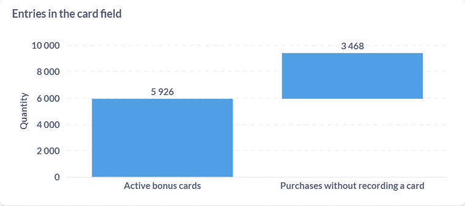
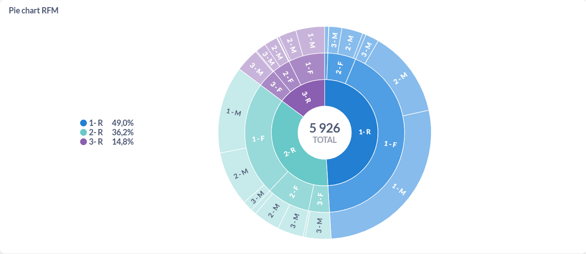
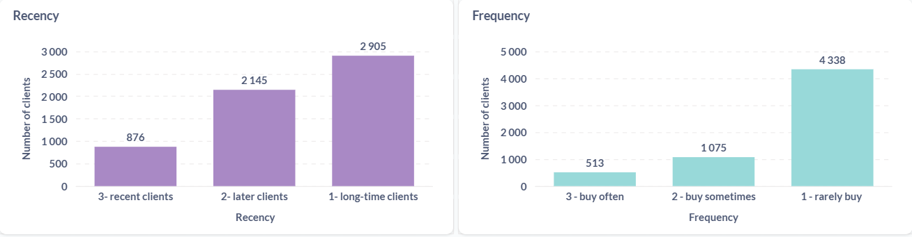
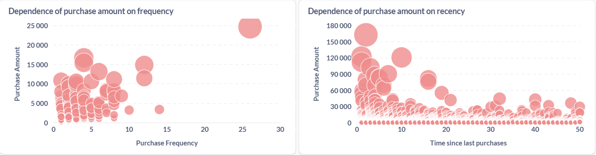

# RFM-pharmacy-analysis (SQL + Metabase)

## Project Overview
This project demonstrates customer segmentation using the **RFM model** (Recency, Frequency, Monetary).  
The analysis was conducted on a pharmacy chain dataset in order to identify loyal clients, at-risk clients, and low-value segments.  
The project highlights **practical data analytics skills**: SQL for data transformation and Metabase for visualization.

## Data
- Main table: **bonuscheques** (synthetic sample included: [`data/bonuscheques.csv`](data/bonuscheques.csv))  

Database schema:  
assests/database structure.PNG

## Methods
1. **Data preparation** — aggregation of transactions by customer.  
2. **Metric calculation** — computed Recency, Frequency, and Monetary values in SQL ([queries/rfm.sql](queries/rfm.sql)).  
3. **Segmentation** — applied quantile-based binning to classify customers into RFM segments.  
4. **Visualization** — dashboards and graphs created in Metabase.

## Results
- **Loyal customers (R=3, F=3, M=3):** ~5,6% of clients  

Example dashboards:  

.PNG)

## Conclusions
RFM analysis provides actionable insights for customer retention strategies.  
Future extensions may include **churn prediction models** and **A/B testing** of marketing campaigns.
